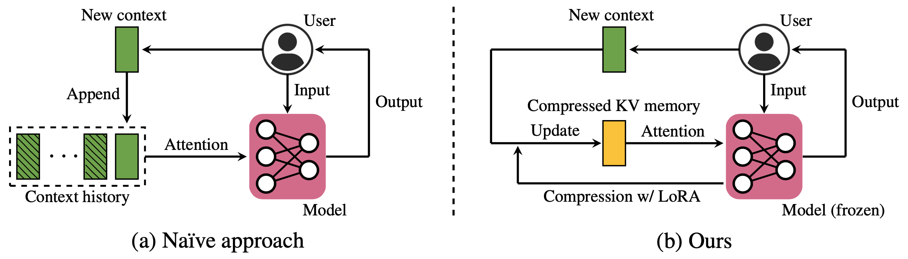

# Compressed Context Memory


[**Paper**](https://arxiv.org/abs/2312.03414) | [**Project Page**](https://janghyun1230.github.io/memory/)

- Our approach dynamically creates **compressed memory of contexts** during LLM interactions. 
- Our approach only requires training a **conditional LoRA for compression**. 
- We use a **fully parallelized training** strategy for recurrent compression procedures. 
- We conduct evaluations on diverse applications: conversation, multi-task ICL, and personalization. 

## Setup
```
conda create --name ccm python=3.9
conda activate ccm
pip install -r requirements.txt
```
- We use PyTorch 2.0.0.

Supported Models: **LLaMA / LLaMA-2-chat**
- Please convert the LLaMA weights into Hugging Face Transformers format using the [guideline](https://huggingface.co/docs/transformers/main/model_doc/llama).
- In [`./path_config.py`](https://github.com/snu-mllab/Context-Memory/blob/main/path_config.py), please set directory configurations.


## Demo: Interactive inference with compressed memory
```
python download.py --type model --dataset all  # Download adapters
python interact.py -i -m llama-7b --eval_name [concat_recur/merge_recur]
```
- This will launch an interactive chat system based on LLaMA-7B:  
  

## Dataset 
- We provide tokenized data of [MetaICL](https://github.com/facebookresearch/MetaICL) and [SODA](https://github.com/skywalker023/sodaverse) for LLaMA. Smaller datasets including DailyDialog will be downloaded and tokenized automatically during training. 
- To download tokenized datasets, run
```
python download.py --type data --dataset [metaicl/soda]
```
- To use other datasets, you should make a collator function. Check for `./src/data`.

## Training
- Our experiments basically run on a single A100 GPU. In the case of DailyDialog, which has a smaller context length, we can run on a single RTX 3090 GPU. 
- Set up a [Wandb](https://wandb.ai/) account for logging, and replace the username with yours in the wandb.entity field of `src/conf/config.yaml`.
- We recommend first finetuning the LLaMA pretrained models on a dataset: 
```
python run.py --train --dataset [all/metaicl/dialog] --model llama-7b \
    --comp_type no
```
- The 'all' dataset refers to the mixture of MetaICL and SODA.
- The LoRA adapters will be saved at `{SAVEPATH}/{dataset}/llama-7b-no`. Set SAVEPATH in path_config.py.
- Then we train our compression adapter as
```
python run.py --train --dataset [all/metaicl/dialog] --model llama-7b \
    --load_path llama-7b-no \ 
    --attn_type [concat_recur/merge_recur] --n_tok [# <COMP> tokens]
```
- Default configurations for each dataset can be found in [`./src/config`](https://github.com/snu-mllab/Context-Memory/tree/05d0b542b7d6cc7339c9b13e66d4c15c600efe34/src/config). The arguments provided by the command line will overwrite the default configurations. 
- For aligned models such as LLaMA-2-chat, it's okay to skip the previous finetuning step with `--comp_type no`. In this case, run the training codes without `--load_path`. 

## Evaluation
- We release optimized adapters via Google Drive. To download, run
```
python download.py --type model --dataset [all/metaicl/soda]
```
- To test models, run
```
python run.py --dataset [all/metaicl/dialog] --model llama-7b \
    --load_path llama-7b-no \ 
    --eval_path [path for compression adapter] \ 
    --attn_type [concat_recur/merge_recur]
```
- The base directory of --load_path and --eval_path is `{SAVEPATH}/{dataset}`. (Set --pretrain_dataset for cross-dataset evaluation, e.g., to evaluate model trained with SODA on DailyDialog, set --pretrain_dataset SODA --dataset dialog). 
- For example, `--eval_path finetune/llama-7b-no-online-concat_recur-ntok2 --attn_type concat_recur` will test CCM-concat with two compression tokens. `--n_tok` argument is automatically parsed. Be aware to set correct `--attn_type` of the adapter. 
- In the case of MetaICL, we use --attn_type [concat/merge] (see [L218-223 in run.py](https://github.com/snu-mllab/Context-Memory/blob/05d0b542b7d6cc7339c9b13e66d4c15c600efe34/run.py#L218C3-L218C3)). To aggregate evaluation results on multiple test tasks, run `parse_results_metaicl.py --dataset [all,metaicl] --folder ['',finetune]`.

## Reference
- This code is created based on the [Gisting repository](https://github.com/jayelm/gisting).

## Citation
```
@article{kim2023compressed,
      title={Compressed Context Memory For Online Language Model Interaction}, 
      author={Kim, Jang-Hyun and Yeom, Junyoung and Yun, Sangdoo and Song, Hyun Oh},
      journal={arXiv preprint arXiv:2312.03414},
      year={2023},
}
```
